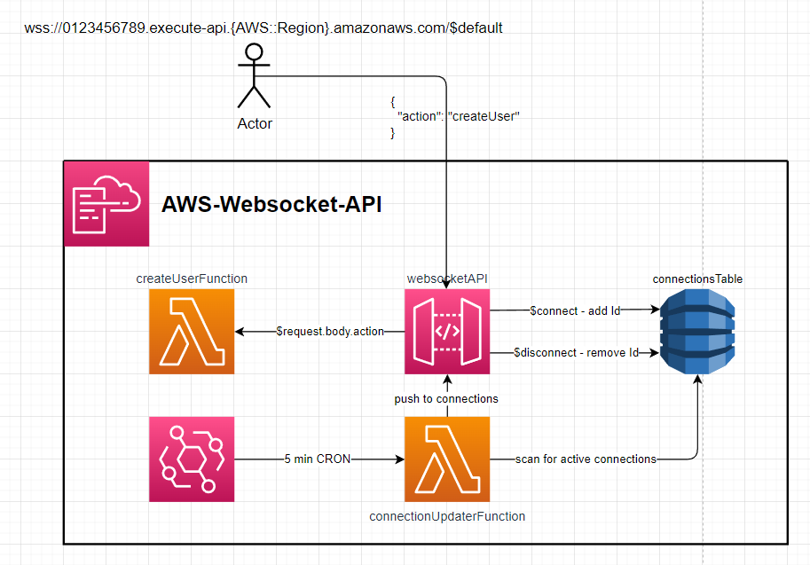
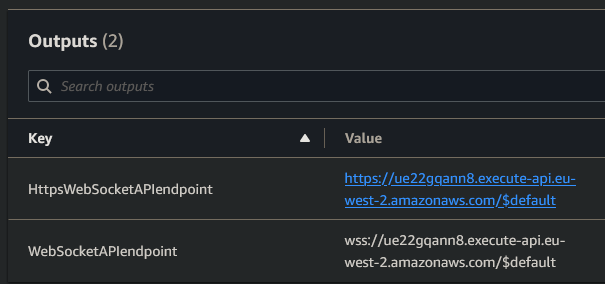
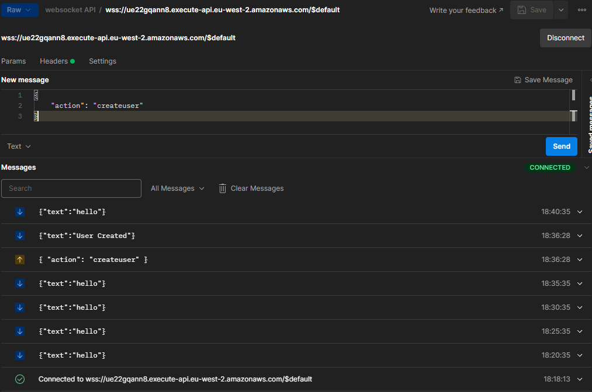

# AWS Webcoket API

This template.yaml defines a `Websocket API` that uses dynamo to store active connectionIds and push updates downstream to connections

  

---

# Setup:  
1. Deploy repository to AWS  
2. Get `WebSocketAPIendpoint` from the stack outputs - E.g. `wss://ue22gqann8.execute-api.eu-west-2.amazonaws.com/$default`  
  
---

# Usage  
1. Connect to `WebSocketAPIendpoint`
   1. Every 5 mins the `connectionUpdaterFunction` will run and push a message to all active connections.  
   2. Send a configured action to the API such as
```json
{
    "action": "createuser"
}
```
  
